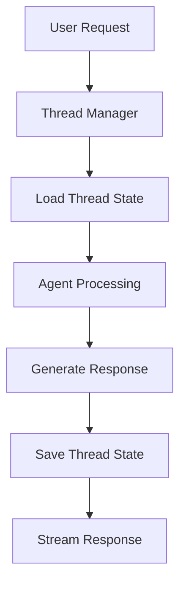

# FastAPI LangGraph with Thread Persistence

Enterprise-grade FastAPI application with LangGraph integration for streaming conversational AI agents featuring thread-based persistence and conversation management.

## 🎯 Key Features

- **Thread-Based Conversations**: Persistent conversation threads with unique identifiers
- **Token-Level Streaming**: Real-time response streaming with WebSocket-like experience
- **Enterprise-Grade Error Handling**: Comprehensive error handling and logging
- **Thread Management**: Complete thread lifecycle management (create, retrieve, clear)
- **RESTful API**: Well-designed API following enterprise patterns
- **Type Safety**: Full TypeScript-style type annotations with Pydantic

## 🏗️ Architecture Overview

### Persistence Strategy

The application implements thread-based persistence using LangGraph's MemorySaver:

- **Thread Checkpoints**: Each conversation thread maintains its state
- **Conversation Continuity**: Threads can be resumed exactly where they left off
- **Message History**: Complete conversation history retrieval for any thread



## 🚀 Quick Start

### 1. Environment Setup

```bash
# Clone the repository
git clone https://github.com/posgnu/fastapi-langraph.git
cd fastapi-langraph

# Create environment file
cp .env.example .env
# Add your OPENAI_API_KEY to .env

# Install dependencies
poetry install
```

### 2. Start the Server

```bash
poetry run uvicorn fastapi_langraph.main:app --reload
```

The server will start at `http://localhost:8000` with:
- API Documentation: `http://localhost:8000/docs`
- Service Info: `http://localhost:8000/info`

### 3. Interactive Chat Client

```bash
# Start the chat client
poetry run python scripts/chat.py
```

The chat client provides:
- Thread management commands
- Conversation history viewing
- Interactive chat interface

## 📚 API Endpoints

### Core Chat Endpoints

#### `POST /chat/stream` - Stream Chat with Persistence
Stream conversational responses with thread persistence.

**Request:**
```json
{
  "input": "Hello, how are you today?",
  "thread_id": "optional-thread-id",
  "session_metadata": {
    "client": "web_app",
    "timestamp": "2024-01-01T00:00:00Z"
  }
}
```

**Response Stream:**
```json
{"type": "metadata", "thread_id": "abc-123", "metadata": {"thread_created": true}}
{"type": "token", "content": "Hello", "thread_id": "abc-123"}
{"type": "token", "content": "!", "thread_id": "abc-123"}
{"type": "metadata", "thread_id": "abc-123", "metadata": {"status": "completed"}}
```

### Thread Management Endpoints

#### `GET /threads/{thread_id}/history` - Thread History
Retrieve conversation history for a specific thread.

**Response:**
```json
{
  "thread_id": "abc-123",
  "history": [
    {
      "timestamp": "2024-01-01T00:00:00Z",
      "messages": [
        {"type": "human", "content": "Hello"},
        {"type": "ai", "content": "Hi there!"}
      ]
    }
  ],
  "total_messages": 1
}
```

#### `DELETE /threads/{thread_id}` - Delete Thread
Delete a specific thread and all its conversation history.

**Response:** 204 No Content on success

#### `PUT /threads/{thread_id}/clear` - Clear Thread
Clear all messages from a thread while keeping it active.

**Response:**
```json
{
  "thread_id": "abc-123",
  "history": [],
  "total_messages": 0
}
```

#### `PUT /threads/{thread_id}/archive` - Archive Thread
Archive a specific thread (placeholder for future implementation).

**Response:**
```json
{
  "thread_id": "abc-123",
  "history": [...],
  "total_messages": 5
}
```

### Service Endpoints

#### `GET /info` - Service Information
Get comprehensive service information and capabilities.

**Response:**
```json
{
  "service": {
    "name": "fastapi-langraph",
    "description": "AI Agent with Thread Persistence",
    "version": "1.0.0"
  },
  "features": {
    "streaming": true,
    "persistence": true,
    "thread_management": true
  },
          "endpoints": {
            "stream": "/chat/stream",
            "thread_history": "/threads/{thread_id}/history",
            "delete_thread": "/threads/{thread_id}",
            "clear_thread": "/threads/{thread_id}/clear",
            "archive_thread": "/threads/{thread_id}/archive"
        }
}
```

## 🛠️ Advanced Usage

### Thread Management Best Practices

1. **Thread Naming Convention**
   ```python
   # Use descriptive thread IDs for better organization
   thread_id = f"session-{session_id}-{timestamp}"
   ```

2. **Context Window Management**
   ```python
   # The agent automatically manages context window size
   # Long conversations are automatically truncated
   ```

3. **Error Recovery**
   ```python
   # Implement retry logic for failed requests
   for attempt in range(3):
       try:
           response = await client.post("/stream", json=data)
           break
       except Exception as e:
           if attempt == 2:
               raise
           await asyncio.sleep(2 ** attempt)
   ```

### Production Deployment Considerations

#### 1. Persistence Backends

For production environments, replace in-memory stores:

```python
# SQLite for small-scale production
from langgraph.checkpoint.sqlite import SqliteSaver
checkpointer = SqliteSaver("./checkpoints.db")

# PostgreSQL for enterprise scale
from langgraph.checkpoint.postgres import PostgresSaver
checkpointer = PostgresSaver(connection_string="postgresql://...")
```

#### 2. Monitoring and Observability

```python
# Add comprehensive logging
import structlog
logger = structlog.get_logger()

# Add metrics collection
from prometheus_client import Counter, Histogram
request_counter = Counter('requests_total', 'Total requests')
response_time = Histogram('response_time_seconds', 'Response time')
```

#### 3. Security Considerations

```python
# Add authentication middleware
from fastapi.security import HTTPBearer
security = HTTPBearer()

# Rate limiting
from slowapi import Limiter
limiter = Limiter(key_func=get_remote_address)

# Input validation
from pydantic import validator
class SecureRequest(BaseModel):
    @validator('input')
    def validate_input_length(cls, v):
        if len(v) > 10000:
            raise ValueError('Input too long')
        return v
```

## 🧪 Testing

### Unit Tests
```bash
poetry run pytest tests/
```

### Integration Tests
```bash
# Test the API endpoints
curl -X POST "http://localhost:8000/chat/stream" \
     -H "Content-Type: application/json" \
     -d '{"input": "Hello", "thread_id": "test-thread"}' \
     --no-buffer
```

### Load Testing
```bash
# Use the chat client for interactive testing
poetry run python scripts/chat.py

# Example conversation flow:
# 1. Start new thread
# 2. Send: "Hello, remember this conversation"
# 3. Check history: /history
# 4. Clear thread: /clear
```

## 🏢 Enterprise Best Practices

### 1. Thread Management Strategy

- **Thread Lifecycle**: Implement proper thread creation, usage, and cleanup
- **Context Management**: Automatic context window management prevents token overflow
- **State Persistence**: Reliable conversation state management

### 2. Scalability Patterns

- **Horizontal Scaling**: Use stateless design with external persistence
- **Load Balancing**: Implement session affinity for thread consistency
- **Caching**: Add Redis for frequently accessed thread states

### 3. Monitoring and Alerting

- **Performance Metrics**: Track response times, thread usage, error rates
- **Business Metrics**: Monitor conversation quality, completion rates
- **Alerting**: Set up alerts for system health and performance degradation

### 4. Data Privacy and Compliance

- **Data Encryption**: Encrypt sensitive conversation data
- **Data Retention**: Implement automatic data purging policies
- **Audit Logging**: Maintain comprehensive audit trails

## 🔧 Configuration

### Environment Variables

```bash
# Required
OPENAI_API_KEY=your-openai-api-key

# Optional
PROJECT_NAME=FastAPI-LangGraph
DESCRIPTION=AI Agent with Thread Persistence
LOG_LEVEL=INFO
MAX_CONVERSATION_LENGTH=20
```

### Advanced Configuration

```python
# Custom agent configuration
AGENT_CONFIG = {
    "model": "gpt-3.5-turbo",
    "temperature": 0.1,
    "max_context_messages": 20,
    "streaming": True
}
```

## 🤝 Contributing

1. Fork the repository
2. Create a feature branch
3. Add comprehensive tests
4. Follow the existing code style
5. Submit a pull request

## 📄 License

MIT License - see LICENSE file for details.

## 🆘 Support

- **Documentation**: Check `/docs` endpoint when server is running
- **Issues**: Submit GitHub issues for bugs and feature requests
- **Discussions**: Use GitHub Discussions for questions and community support

---

**Built with ❤️ using FastAPI, LangGraph, and OpenAI**
